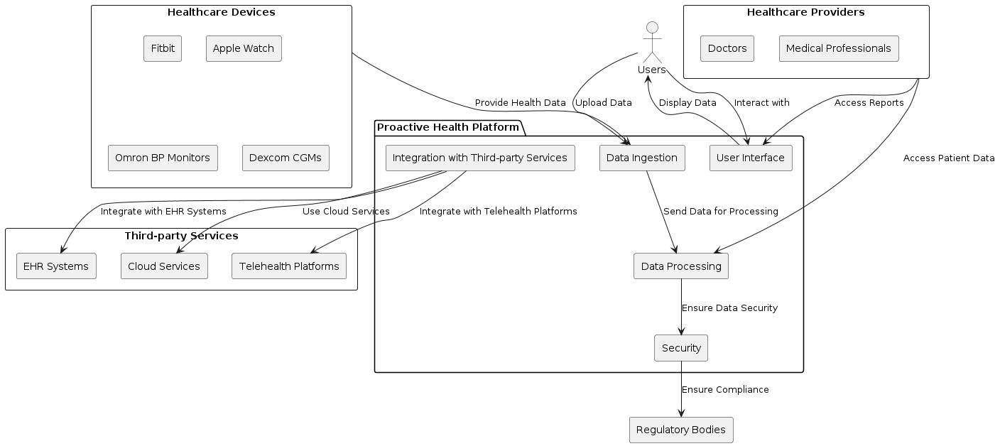

Generated with the aid of AI.

# Proactive Health Platform

## Product Overview

The Proactive Health Platform is a comprehensive solution designed to empower users to take control of their health by seamlessly integrating data from various healthcare devices. It provides intuitive data visualization, actionable insights, and robust security to ensure compliance with healthcare regulations.

USP:  Share all your personal healthcare info securely with your healthcare doctor or provider with the click of a button in real-time.

## System Context (C4) ##

## Business Capabilities

### Data Integration
- **Seamless Device Connectivity**: Integrates with leading healthcare devices such as Fitbit, Apple Watch, Omron BP Monitors, and Dexcom CGMs.
- **Unified Data Ingestion**: Collects data in real-time or via scheduled syncs from multiple sources, standardizing it for consistent analysis.

### Health Monitoring and Analytics
- **Personalized Dashboards**: Users can view and customize their health metrics and trends through a user-friendly interface.
- **Advanced Analytics**: Utilizes machine learning to provide predictive analytics and personalized health recommendations based on individual data patterns.

### Security and Compliance
- **Data Privacy**: Ensures data is encrypted at rest and in transit, adhering to GDPR, HIPAA, and other relevant regulations.
- **User Consent Management**: Users control their data sharing preferences, ensuring transparency and trust.

### Interoperability with Healthcare Ecosystems
- **Healthcare Provider Integration**: Enables seamless data sharing with healthcare providers, facilitating virtual consultations and better patient management.
- **Third-party Services**: Integrates with telehealth platforms, EHR systems, and cloud services for enhanced functionality and accessibility.

## User Experience

### User Interface
- **Intuitive Design**: The platform features a modern, easy-to-navigate interface, making it accessible for users of all technical levels.
- **Customizable Dashboards**: Users can personalize their dashboard to highlight the health metrics that matter most to them.

### Data Visualization
- **Interactive Charts and Graphs**: Users can visualize their health data trends over time with interactive elements that allow for deeper analysis.
- **Comprehensive Health Reports**: Generates detailed reports that users can share with their healthcare providers for informed consultations.

### Notifications and Alerts
- **Real-time Alerts**: Immediate notifications for any significant changes in health metrics, helping users take timely actions.
- **Routine Reminders**: Set reminders for medication, appointments, and routine check-ups to ensure users stay on track with their health goals.

## Contributing

If you have suggestions or improvements, feel free to create an issue or submit a pull request.

## License

This project is licensed under the MIT License. See the [LICENSE](LICENSE) file for details.
